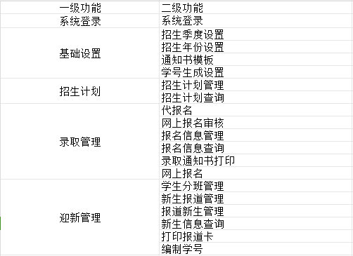
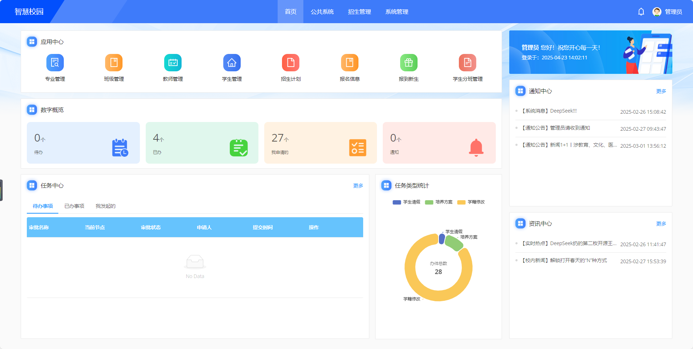
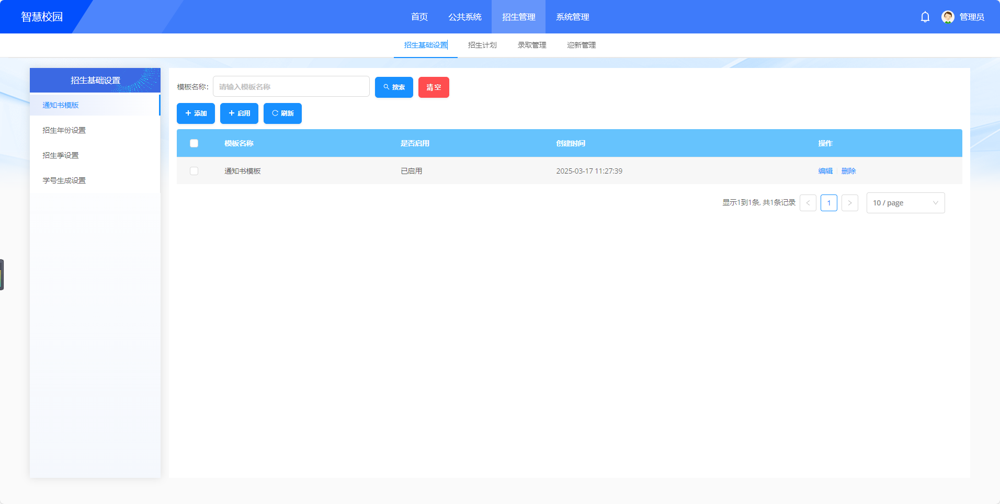
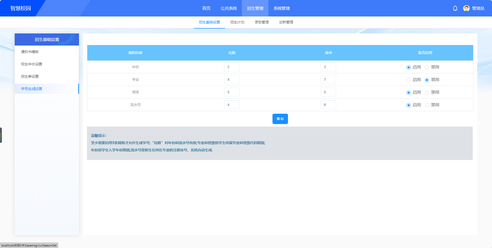
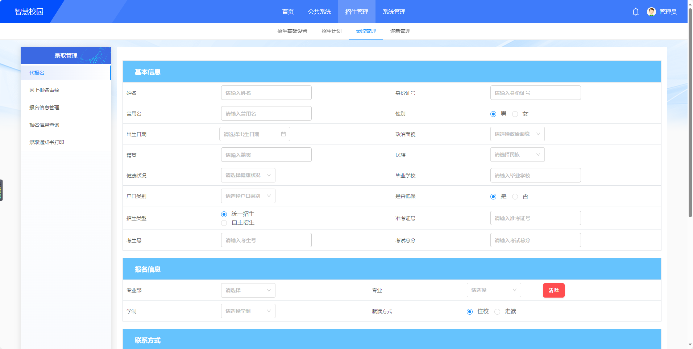

### 招生管理平台系统

### 介绍

招生管理系统是基于VUE+ elementui的开源招生管理平台系统；其中提供包含如招生、录取、迎新等各个方面的服务，方便用户可以使用本系统快捷、简洁、从容的完成关于招生的数据操作、管理。

### 软件架构

架构上我们选择当下最主流的也是最具兼容性的方案。
管理后台我们采用 vue2 + elementui 方便你快速的入门并实现开发。相较于传统的jq框架来说，vue2 + elementui 具有更容写逻辑、更容在后台开发中使用标准且美观的样式优点。
- 基础框架：[ant-design-vue](https://github.com/vueComponent/ant-design-vue) - Ant Design Of Vue 实现
- JavaScript框架：Vue
- Webpack
- node
- yarn
- eslint
- @vue/cli 3.2.1
- [vue-cropper](https://github.com/xyxiao001/vue-cropper) - 头像裁剪组件
- [@antv/g2](https://antv.alipay.com/zh-cn/index.html) - Alipay AntV 数据可视化图表
- [Viser-vue](https://viserjs.github.io/docs.html#/viser/guide/installation)  - antv/g2 封装实现

### 功能清单

### 项目下载和运行
- 拉取项目代码
- 安装依赖
npm install

- 开发模式运行
npm run serve

- 编译项目
npm run build

### 项目图片预览

### 联系方式
### 微信联系方式

 

### QQ群

### 期待您的联系

